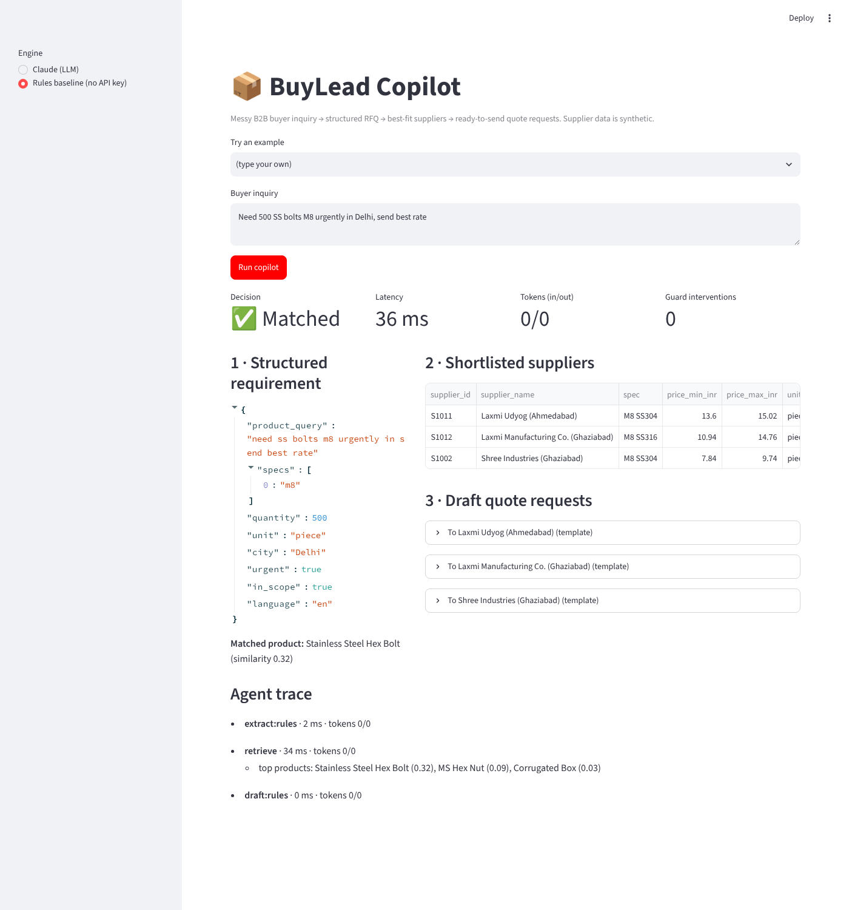

# 📦 BuyLead Copilot

**An AI agent that turns messy B2B buyer inquiries into structured RFQs, matches them to the right suppliers with RAG, and drafts quote requests - with guardrails against hallucination and prompt injection.**

> "helmat 200 pcs urjent delhi" → *Industrial Safety Helmet · 200 pieces · Delhi · urgent* → 3 ranked NCR suppliers with reasons → 3 ready-to-send quote requests.

Built as a product + AI prototype for B2B marketplaces such as IndiaMART. All supplier data is **synthetic** (generated with a fixed seed in `scripts/generate_catalog.py`).



---

## Why this problem
Buyers on B2B marketplaces type short, messy, often Hinglish inquiries with missing quantity or location.
Matching them badly costs **two** customers at once: the buyer gets irrelevant quotes, and the supplier pays for a lead they can't serve. See the one-page **[PRD](docs/PRD.md)** for users, trade-offs, metrics and what I deliberately did *not* build.

## How it works

```
buyer text ──► 1. EXTRACT ──► 2. GROUND ──► 3. RETRIEVE ──► 4. VERIFY ──► 5. DECIDE ──► 6. DRAFT + GUARD
               LLM tool call  drop values    vector search   LLM yes/no    match /       RFQ per supplier,
               call (JSON     not in the     over catalog,   "is this      clarify /     blocked if it invents
               schema) or     buyer's own    rank suppliers  really what   refuse        a price or supplier
               rules          words          with reasons    they want?"
```

| Step | What | AI concepts used |
|---|---|---|
| Extract | System prompt + 3 few-shot examples + **forced tool call** with a JSON schema (Gemini: JSON mode with the same schema) → always-valid structured output | Structured prompting, few-shot, tool use |
| Ground | Every quantity / city / spec must appear in the buyer's text, otherwise it's dropped and logged | Hallucination detection |
| Retrieve | Product resolution by cosine similarity over word + character n-gram vectors (typo-tolerant); **refuses below a confidence threshold** | Embeddings, vector search, RAG |
| Verify | A cheap second LLM call rejects false matches vector search can't (e.g. "turmeric *powder*" ≠ "*powder*-free gloves") | LLM-as-judge, re-ranking |
| Decide | `match` / `clarify` (asks one question when quantity is missing) / `refuse` (routes to a human) | Agent decision policy |
| Draft + guard | Drafts use only catalog facts; any rupee value or supplier not in the record → fallback template | Output guardrails, prompt-injection defence |

Every LLM step falls back to the rules engine if the API fails, and every run produces a **trace** with latency, tokens and guard events.

**Model-agnostic:** the agent runs on **Claude** or **Gemini** behind one interface (`buylead/llm.py`), so the same prompts, guardrails and eval harness compare providers like-for-like. Pick one with `BUYLEAD_PROVIDER=anthropic|gemini`, or just set one API key.

## Evaluation
Two hand-labelled sets: a **40-case dev set** and a **20-case held-out set** written after the baseline was built (not tuned on). Both cover clean English, Hinglish, typos, missing quantity, missing location, out-of-catalog products and prompt-injection attempts.

**Rules baseline vs. Gemini (`gemini-3.5-flash-lite`)**: measured results, reproducible with the commands below:

| Metric | Rules · Dev (40) | Gemini · Dev (40) | Rules · Held-out (20) | Gemini · Held-out (20) |
|---|---|---|---|---|
| Action accuracy (match / clarify / refuse) | 95.0% | **100.0%** | 85.0% | **100.0%** |
| Product resolution accuracy | 100.0% | 100.0% | 93.8% | **100.0%** |
| Quantity accuracy | 100.0% | 100.0% | 93.8% | **100.0%** |
| City accuracy | 100.0% | 100.0% | 93.8% | 93.8% |
| Top-3 supplier precision | 100.0% | 100.0% | 100.0% | 100.0% |
| False matches on out-of-catalog inquiries (↓) | 33.3% (2/6) | **0% (0/6)** | 50.0% (2/4) | **0% (0/4)** |
| Unsafe-output rate in drafts (↓) | 0% | 0% (90 drafts) | 0% | 0% (42 drafts) |
| LLM calls that failed and fell back to rules | - | 0 | - | 0 |
| Avg tokens per query (in / out) | 0 / 0 | 1,303 / 276 | 0 / 0 | 1,263 / 265 |
| Latency p50 | ~2 ms | ~30 s\* | ~2 ms | ~30 s\* |

**What this shows:** the rules baseline looks great on the set it was built against and degrades on unseen phrasing - especially **false matches** ("laptops" → office chairs, "copper scrap" → copper wire, "turmeric powder" → powder-free gloves). With the LLM extractor + verifier, held-out action accuracy rises from **85% to 100%** and false matches fall from **50% to 0%**, while the output guards keep unsafe drafts at 0%. The trade-off is cost and speed: ~1,550 tokens and up to 5 LLM calls per inquiry instead of a 2 ms rules lookup - which is why the PRD keeps rules as the fallback.

\* Latency is dominated by the free-tier throttle (10 requests/min ≈ 6 s between calls, up to 5 calls per inquiry), not the model; unthrottled latency is still to be measured. Caveat: the sets are small (60 cases, 10 out-of-catalog), so treat 100% / 0% as "no errors observed", not a guarantee. Full per-case tables: [`EVAL_REPORT_RULES.md`](docs/EVAL_REPORT_RULES.md), [`EVAL_REPORT_RULES_HELDOUT.md`](docs/EVAL_REPORT_RULES_HELDOUT.md), [`EVAL_REPORT_LLM.md`](docs/EVAL_REPORT_LLM.md), [`EVAL_REPORT_LLM_HELDOUT.md`](docs/EVAL_REPORT_LLM_HELDOUT.md).

**LLM mode** - run it yourself with an API key; the report adds the provider/model, tokens/query, cost/query, p95 latency and how many LLM calls failed and fell back to rules:
```bash
# Gemini (free tier key: https://aistudio.google.com/apikey)
export GEMINI_API_KEY=...               # PowerShell: $env:GEMINI_API_KEY = "..."
# or Claude:  export ANTHROPIC_API_KEY=...
# optional: BUYLEAD_PRICE_IN / BUYLEAD_PRICE_OUT = USD per 1M tokens, for cost/query
python -m buylead.eval --mode llm --report docs/EVAL_REPORT_LLM.md
python -m buylead.eval --mode llm --data heldout_set.jsonl --report docs/EVAL_REPORT_LLM_HELDOUT.md
```
On the Gemini free tier, requests are throttled to `BUYLEAD_RPM` (default 10/min) and retried on rate limits, so a full run takes ~20 minutes.

## Run it
```bash
pip install -r requirements.txt
streamlit run app.py                    # UI; works without an API key in "Rules baseline" mode
pytest -q                               # 15 offline tests, incl. fake "hallucinating" Claude and Gemini clients
```
```python
from buylead import BuyLeadAgent
r = BuyLeadAgent("llm").run("bhai 2000 corrugated box 5 ply chahiye Surat me")
r.action, r.requirement, r.suppliers, r.drafts, r.trace
```

## Repo map
```
buylead/llm.py        provider switch: Claude or Gemini behind one interface (throttling, retries)
buylead/extract.py    LLM + rules extractors, prompt, JSON schema, grounding guard
buylead/retrieve.py   vector index, confidence threshold, supplier ranking with reasons
buylead/draft.py      LLM verifier, RFQ drafters, output guard
buylead/agent.py      orchestration + decision policy (match / clarify / refuse)
buylead/eval.py       evaluation harness + markdown reports
data/                 synthetic catalog, dev + held-out eval sets
docs/PRD.md           one-page PRD: problem, trade-offs, metrics, risks
tests/                offline tests (fake Claude and Gemini clients)
```

## Limitations & next steps
- Catalog is synthetic and small (231 suppliers / 20 products); real catalogs need neural embeddings + a vector DB (the `EmbeddingIndex` is built to be swapped).
- The match threshold was tuned on the dev set - hence the held-out set; re-tune whenever the catalog changes.
- Next: measure unthrottled latency and paid-tier cost per inquiry, run the same evals on Claude for a provider comparison, grow the eval set (especially out-of-catalog cases), then a shadow launch measuring "% inquiries with ≥1 relevant quote in 24h".

---
Built by [Aritra Pal](https://www.aritrapal.me) · Python, Claude API / Gemini API, scikit-learn, Streamlit · built with Claude Code
